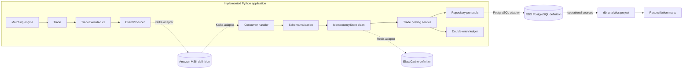

# Trading Data Core

Trading Data Core is a synthetic financial data platform focused on precise,
replay-safe trade processing. It evolves a deterministic matching and
double-entry ledger core into explicit persistence, idempotency, event
transport, analytics, and deployment boundaries. The project exists to show
how financial correctness survives failures and replays—not to simulate
production scale or provide a trading product.

## Implementation status

### Implemented application behavior

- Deterministic limit-order storage and market-buy matching
- `Decimal` trade prices, ledger amounts, and reconciliation calculations
- Versioned `TradeExecuted` envelopes with correlation and idempotency metadata
- Balanced double-entry journals for executed trades
- Repository protocols, deterministic in-memory repositories, and a
  transactional trade-plus-ledger service
- Parameterized PostgreSQL repository adapters and an operational migration
- Atomic in-memory and Redis `SET NX` idempotency adapters
- Kafka-compatible producer/consumer boundaries, JSON schema validation,
  retry classification, DLQ records, and observability hooks
- dbt staging, intermediate, mart, documentation, and financial assertion files
- Deterministic Python tests that need no live PostgreSQL, Redis, or Kafka

### Deployment architecture and infrastructure definitions

Terraform under `infra/` defines a possible private AWS deployment using VPC
subnets and security groups, RDS for PostgreSQL, ElastiCache for Redis, Amazon
MSK, IAM, and CloudWatch. These are reviewed source definitions only. **Nothing
in this repository has been deployed to AWS.** No cloud resources, hosted
database, Redis service, Kafka cluster, or analytics warehouse are included.

## Architecture



The dotted services are adapter targets or deployment definitions. Local unit
tests use in-memory implementations instead.

## Financial processing flow

1. A market order consumes deterministic price levels and creates a `Trade`.
2. The trade becomes a versioned `TradeExecuted` event with a stable
   `trade:<trade_id>` idempotency key.
3. A consumer validates the envelope before any financial work.
4. The idempotency store atomically claims the key. A duplicate stops here.
5. The posting service creates a balanced debit/credit journal.
6. Trade and journal repositories commit in one unit-of-work boundary or roll
   back together.
7. Downstream dbt models compare trade notional with ledger postings.

## `TradeExecuted` event design

`EventEnvelope` carries `event_id`, `event_type`, `schema_version`, UTC
`occurred_at`, `correlation_id`, `idempotency_key`, and payload. The v1 payload
contains the executed trade, with price serialized as a decimal string and
timestamp as ISO-8601. Transport serialization is deterministic JSON. The
consumer rejects malformed JSON, missing fields, unsupported versions, invalid
sides, and timezone-naive trade timestamps before invoking financial logic.

Correlation and event identifiers are copied into transport headers and
structured observability attributes. The idempotency key is the message key,
which supports stable partitioning by financial fact.

## Ledger design

Each trade produces one journal with equal debit and credit amounts:

| Account | Direction | Amount | Reference |
|---|---|---:|---|
| `customer_asset` | `DEBIT` | trade price × quantity | `trade:<id>` |
| `broker_cash` | `CREDIT` | trade price × quantity | `trade:<id>` |

The domain ledger validates journal balance before exposing entries. The SQL
schema adds a unique posting key across journal, account, and direction plus
positive-amount and direction constraints. This simplified chart of accounts
is intentionally educational and should be reviewed before representing any
real brokerage accounting policy.

## Reconciliation strategy

The Python reconciliation function compares each trade notional with its debit
posting for immediate deterministic checks. dbt independently builds a
trade-to-ledger comparison and classifies rows as `RECONCILED`,
`MISSING_LEDGER`, `UNBALANCED_LEDGER`, or `NOTIONAL_MISMATCH`. Singular dbt
tests assert balanced journals and zero variance for reconciled trades.

## Technology responsibilities

- **PostgreSQL:** durable executed trades and ledger entries, fixed precision,
  constraints, indexed operational access, and transaction commits/rollbacks.
- **Redis:** only atomic event-idempotency claims. It is not a general cache.
- **Kafka-compatible transport:** delivery, partition keys, correlation
  metadata, and broker adapter concerns; it contains no ledger rules.
- **dbt:** downstream transformation, documentation, tests, and reporting
  marts. It does not execute transactions or process events.
- **Terraform/AWS:** undeployed infrastructure definitions for RDS,
  ElastiCache, MSK, private networking, IAM, and CloudWatch.

Amazon MSK is the single proposed streaming service. It preserves compatibility
with the implemented Kafka boundary and its consumer-group/replay model; adding
Kinesis would introduce a second transport without a current responsibility.

## Failure, retry, and idempotency behavior

Redis claims use one atomic `SET NX` operation. Redis failures fail closed, so
financial side effects do not proceed when uniqueness cannot be established.
Claims are permanent by default. A configured TTL bounds storage but must
exceed every broker replay, retry, and backfill window or an old duplicate can
post again. Failed processing releases its claim so a legitimate retry can run.

The consumer retries only explicitly retryable processing and idempotency-store
errors. Exhausted retryable errors and all non-retryable validation/business
errors produce a DLQ record containing the original message, error class,
message, and attempt count. In a deployed consumer, message acknowledgement
must occur only after success, duplicate classification, or durable DLQ write.

## dbt analytics architecture

```text
operational.trades + operational.ledger_entries
  -> stg_operational__*
  -> int_trade_notionals / int_ledger_activity / int_trade_to_ledger
  -> fct_trade_activity / fct_ledger_postings
  -> fct_reconciliation_status / fct_reconciliation_exceptions
```

The sample profile uses environment variables and is not a credential file.
A PostgreSQL database containing the operational tables is required to run
`dbt build`.

## Terraform and AWS architecture

The `dev` root composes focused network, database, Redis, streaming, IAM, and
monitoring modules. Data services are private and accept traffic only from the
application security group. RDS uses an AWS-managed master secret; the Redis
token is a sensitive input expected from an external secret mechanism. MSK uses
TLS and IAM authentication. The example runtime role is restricted to the
configured cluster, `trades.*` topics, and `trading-data-*` consumer groups.

Production state should use a separately bootstrapped encrypted/versioned S3
bucket, native state locking, and a narrowly scoped CI role. State and
environments must be isolated. See [infra/README.md](infra/README.md).

## Testing strategy

The test suite exercises the financial domain plus contract-like in-memory
repositories, rollback, precision/timezone preservation, atomic idempotency,
Redis failure behavior, serialization, malformed events, duplicate delivery,
retry classification, DLQ behavior, and correlation propagation. Tests are
deterministic and do not require external services.

```bash
python -m pytest -q
```

Database/broker integration tests and warehouse-backed dbt builds are future
environment-gated checks; they are not misrepresented as unit coverage.

## CI

GitHub Actions checks out the repository, installs the pinned Python
requirements on Python 3.12, and runs `python -m pytest -q`. It intentionally
does not attempt AWS, Kafka, PostgreSQL, Redis, dbt, or Terraform integration
without deterministic infrastructure and credentials.

## Security principles

- No credentials, account IDs, access keys, or connection strings in source
- RDS-managed master credentials and external Redis secret injection
- TLS for proposed Redis and MSK traffic; encryption at rest for RDS/Redis
- Private data services and source-security-group ingress
- Least-privilege IAM examples scoped to necessary Kafka resources/actions
- Parameterized SQL and schema constraints at the persistence boundary
- Synthetic data only

Terraform state can contain sensitive values even when outputs are marked
sensitive. A real deployment must protect state, plans, logs, and CI variables.

## Project structure

```text
analytics/             dbt project: sources, models, docs, and assertions
data/                  synthetic CSV examples
docs/                  architecture and idempotency decisions
infra/                 undeployed Terraform environments and modules
migrations/            PostgreSQL operational schema
src/
  persistence/         repository contracts and in-memory/PostgreSQL adapters
  services/            application orchestration
  transport/           serialization, Kafka/memory adapters, retry, and DLQ
  engine.py            deterministic matching flow
  events.py            versioned event envelope
  idempotency.py       in-memory and Redis claim stores
  ledger.py            double-entry domain logic
  models.py            order and trade domain models
  reconciliation.py    immediate trade-to-ledger comparison
tests/                 deterministic Python tests
```

## Local development

Python 3.12 is the CI baseline.

```bash
python -m venv .venv
source .venv/bin/activate
python -m pip install -r requirements.txt
python -m pytest -q
python run.py
```

No external service is needed for unit tests. PostgreSQL adapters accept an
injected DB-API-style connection factory; Redis and Kafka adapters accept
injected clients. Apply `migrations/001_operational_financial_schema.sql` only
to a disposable PostgreSQL environment you control.

For dbt, copy `analytics/profiles.yml.example` to your external dbt profile
directory and provide environment variables. For Terraform validation, follow
`infra/README.md`; do not apply without an authorized account and reviewed plan.

## Roadmap

- Containerized PostgreSQL/Redis/Kafka integration tests behind an opt-in job
- Durable Kafka offset/DLQ integration and transactional outbox evaluation
- Schema Registry compatibility checks and explicit event evolution policy
- Account/customer dimensions and richer brokerage accounting rules
- Warehouse-specific dbt CI using isolated schemas and seeded synthetic cases
- OpenTelemetry metrics/traces and operational runbooks/SLOs
- Terraform plan policy checks, cost estimates, and disaster-recovery exercises

## Synthetic-data disclaimer

All repository data and examples are synthetic. They contain no employer,
client, customer, proprietary, or production trading data. This project is an
educational portfolio system and is not financial, accounting, or investment
advice.
